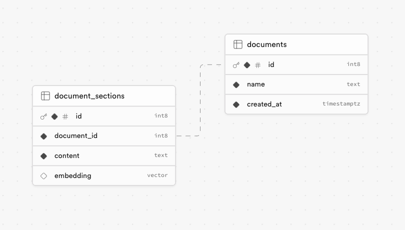
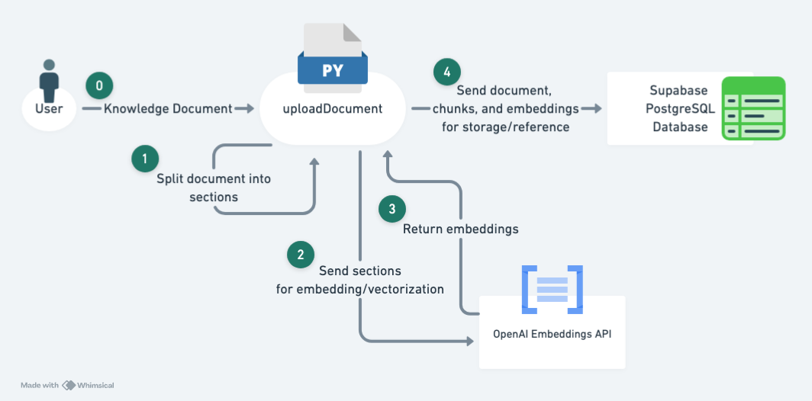
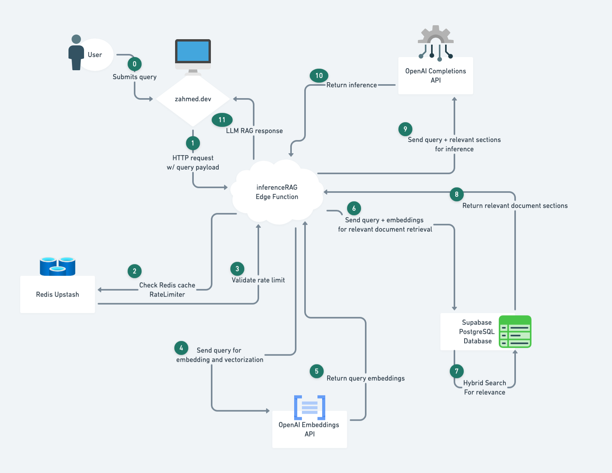

# Supabase RAG Project

This repository contains two main functions for implementing a Retrieval-Augmented Generation (RAG) system using Supabase and OpenAI:

1. uploadDocuments: Processes documents for embedding and storage
2. Deployed Supabase Edge Function: Handles user queries and performs RAG

## Architecture

### Document Schema


This diagram illustrates the database schema used for storing document information and embeddings in Supabase's Postgres database.

### Upload Document Flow


This flowchart demonstrates the process of uploadDocument.py, which handles document splitting, embedding, and insertion into the Supabase database.

### Inference RAG Flow


This flowchart shows the process of the Supabase Edge Function, inferenceRAG, which takes a user's query, performs RAG, and returns the inference result.

## Main Dependencies

- OpenAI API: Used for generating embeddings and performing inference
- Supabase: Provides storage and database functionality as well as serverless functions
- Redis Upstash: Used for rate limiting the Edge Function

## UploadDocument

The uploadDocument script is responsible for processing documents. It performs the following tasks:

1. Splitting documents into chunks
2. Generating embeddings for each chunk using OpenAI's API
3. Inserting the document chunks and their embeddings into Supabase's Postgres database

## Supabase Edge Function

The deployed Supabase Edge Function handles user queries and performs RAG. Its main tasks include:

1. Receiving user queries
2. Performing similarity search on stored embeddings
3. Retrieving relevant document chunks
4. Generating a response using OpenAI's API
5. Returning the inference result to the user

The Edge Function is rate-limited using Redis Upstash to ensure fair usage and prevent overload.

## Getting Started

### uploadDocument Setup

1. Clone the repository:
   ```
   git clone https://github.com/yourusername/supabase-rag-project.git
   cd portfolio-rag
   ```

2. Create and activate a virtual environment:
   ```
   python -m venv venv
   source venv/bin/activate  # On Windows, use `venv\Scripts\activate`
   ```

3. Install dependencies:
   ```
   pip install -r requirements.txt
   ```

4. Set up environment variables (create a `.env` file in the project root):
   ```
    UPSTASH_REDIS_REST_URL=""
    UPSTASH_REDIS_REST_TOKEN=""
    OPENAI_API_KEY=''
    SUPABASE_URL=''
    SUPABASE_SERVICE_ROLE_KEY=""
   ```

### Edge Function Deployment

For deploying the Supabase Edge Function, please refer to the official Supabase documentation:

[Supabase Edge Functions Documentation](https://supabase.com/docs/guides/functions)

## Usage

### uploadDocument Usage

To process and upload a document:

```
python uploadDocument.py <path_to_document>
```

Replace `<path_to_document>` with the actual path to the document you want to process.
